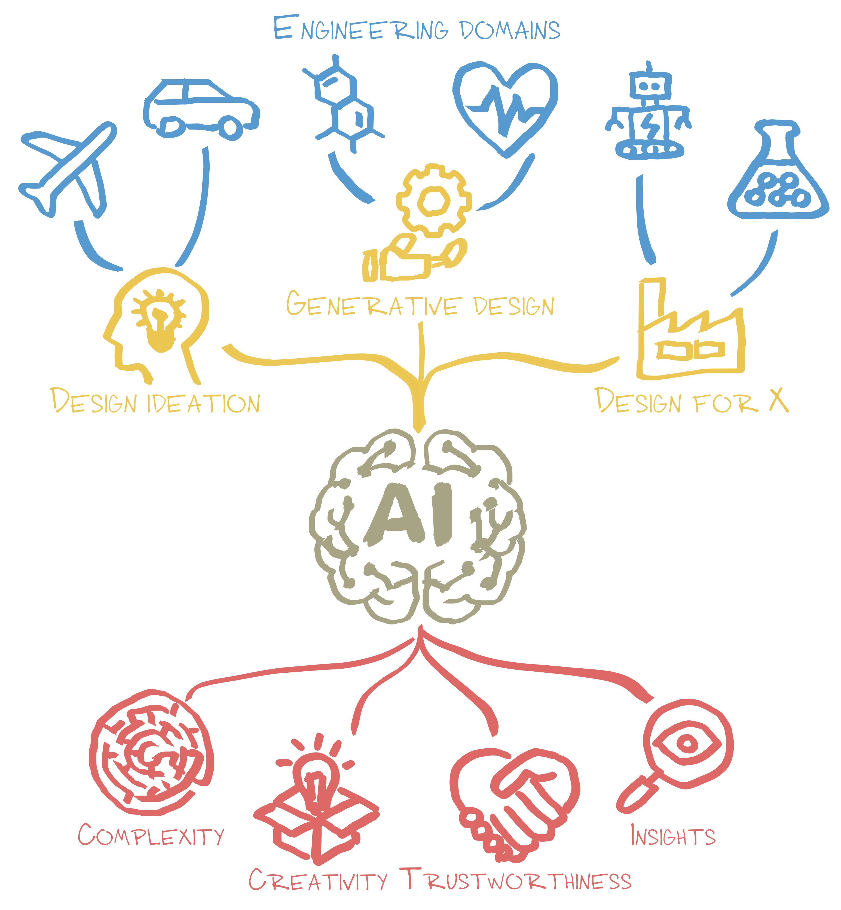

Research in the DIGIT Lab aims to answer this overarching question: *How can AI design better materials, structures, and machines?* Our goal is to establish a new paradigm of AI-driven engineering design, transforming AI from a supportive tool into the primary driver for designing and discovering superior materials, structures, and machines. In this paradigm, AI not only solves complex design problems and finds innovative solutions, but also does so in a trustworthy manner while discovering new insights that expand our knowledge and drive further innovation. Despite significant advancements in AI, a considerable gap separates this vision from today’s reality. To fill this gap and unlock AI’s true potential in engineering design, I aim to tackle the following four fundamental challenges:

1. **Complexity.** Advances in manufacturing have unlocked immense design complexity, leading to dramatic improvements in functional capabilities. Yet, a gap persists between what we can build and what we can design, preventing the full exploitation of these modern capabilities. This raises a critical question: *How can AI unlock design complexities that are fundamentally inaccessible to traditional methods?*
2. **Trustworthiness.** Trust is essential for adopting AI-generated designs in safety-critical applications. This is blocked by “black box” AI models that provide solutions without clear explanations or confidence assessments. Our research aims to answer: *How can we develop AI-driven design methodologies that engineers can trust?*
3. **Discoverability.** We believe the promise of AI in design is not just better final products, but making us better designers. We aim to develop methods that decode the complex patterns in data or AI models into human-understandable knowledge (e.g., new design rules or unknown structure-property relationships). This drives a fundamental question: *How can AI discover new knowledge that expands human understanding and guides design innovation?* 
4. **Creativity.** Human creativity is always constrained by individual knowledge, experience, and cognitive biases, while today’s AI excels at interpolating existing data but struggles to generate genuinely new ideas. To transform AI from a tool of interpolation into an engine for innovation, our research asks: *How can AI enable or accelerate the discovery of "out-of-the-box" design solutions and become a true inventor?*

Guided by these fundamental questions, we develop computational methodologies for design ideation, generative design, and design for X ("X" can represent manufacturing, sustainability, reliability, and beyond) across diverse engineering domains.

For more information, you can explore our [**paper collection**](/publication/) or check out our [**open-source code**](https://www.github.com/DIGITLab23).
