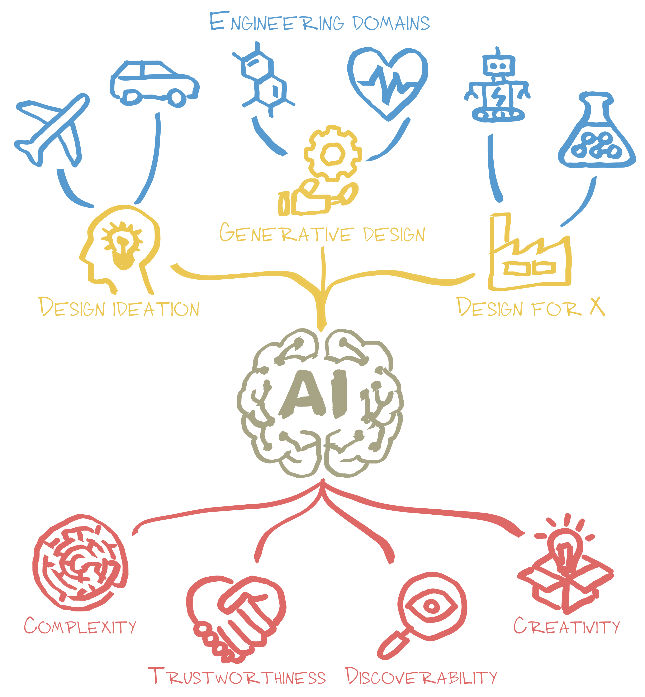

Research in the DIGIT Lab aims to answer this question: How can AI design better materials, structures, and machines? There are three major themes around this question:

* **Design ideation:** Human creativity is constrained by individual knowledge and experience, with outcomes often highly uncertain. We explore how AI can enhance the generation of creative design ideas, fostering human-AI co-creativity and accelerating design innovation.
* **Design automation:** We develop AI and ML methods to automatically generate high-quality, detailed design solutions from specific targets, addressing key challenges such as expansive design spaces, costly design evaluations (e.g., simulations and experiments), and inherent uncertainties.
* **Design for X:** The "X" encompasses a range of design objectives, such as manufacturing, sustainability, reliability, and beyond. We leverage AI, ML, and optimization to efficiently generate design solutions that balance and enhance these goals across complex design spaces.

Engineering design problems span a wide range of domain-specific contexts--such as aerospace (e.g., designing aerodynamic shapes and structures), materials science (e.g., designing new materials and metamaterials), and robotics (e.g., designing soft actuators). Our research **abstracts these domain-specific problems and reformulates them as mathematical problems**, developing AI-driven design methodologies to solve them while incorporating domain knowledge when needed.

Our methodologies usually follow a **"generative"** paradigm, where AI learns to generate design solutions by modeling their underlying distributions and capturing uncertainties. Our goal is to leverage AI and ML to improve **efficiency**, stimulate **creativity**, and uncover **new knowledge and insights** in design processes, while ensuring the **generalizability** and **trustworthiness** of these methods. 

For more information, you can explore our [**paper collection**](/publication/) or check out our [**open-source code**](https://www.github.com/DIGITLab23).
